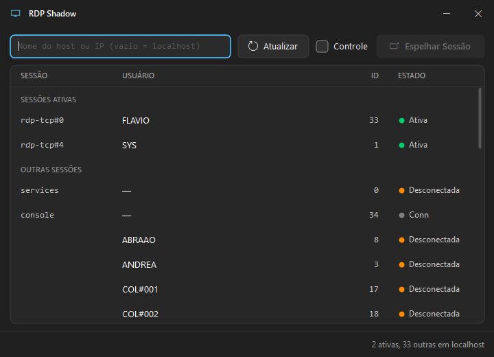

# RDP Shadow

A tiny Windows tool to shadow (mirror) active Remote Desktop sessions — view or take
control of another user's session. It lists sessions with Windows' built-in `query.exe`
and attaches with `mstsc.exe /shadow`.

Pure C on Win32 + GDI+ — a single **~110 KB** `.exe`, no runtime or dependencies.



## Download

Grab `RdpShadow.exe` from the [**Releases**](../../releases/latest) page. Run it — it
asks for administrator rights (needed for shadowing) and lists the local sessions right away.

## Use

1. Leave the box empty for localhost, or type a hostname/IP and press **Enter** / **F5**.
2. Pick a session.
3. Tick **Control** if you want keyboard + mouse (otherwise it's view-only).
4. Click **Shadow Session** (or double-click the row).

The UI is English or Brazilian Portuguese, chosen from the Windows display language.

> Shadowing must be allowed by Group Policy on the target machine
> (*Set rules for remote control of Remote Desktop Services user sessions*).

## Build

Needs a [MinGW-w64](https://winlibs.com) GCC toolchain at `C:\CLAUDE\toolchains\mingw64`
(or edit the path in `build.cmd`), then:

```bat
build.cmd
```

Output: `publish\RdpShadow.exe`.

## License

MIT
